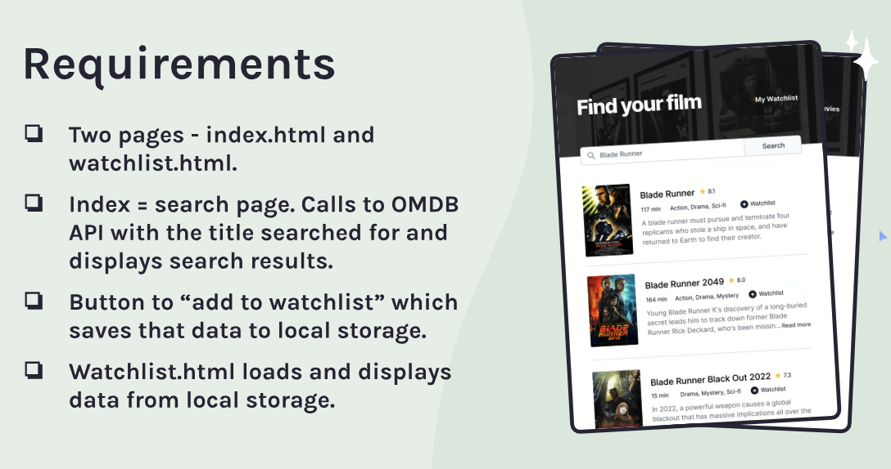

## Movie Watchlist

### The requirements:



### How does the app work?

The user picks movies from the OMDb (Open Movie Database) API to add movies to a personal watchlist on a separate page of the app.

### Process

- Consult Figma design files
- Create draft of README file
- Create .gitignore file and check that meta tag is included
- Create Github repository
- Work on HTML, CSS and JS files
- Check final code and accessibility
- Finalize README file
- Publish live URL

### Cool code snippets

```css
.search-btn {
  background-color: transparent;
}
```

### Resources:

[Youtube video: Using localStorage in JavaScript](https://youtu.be/LfeOLVGHiXI?si=vt9pSplpwzLvt1Bs)

[freeCodeCamp article: How Web Storage Works](https://www.freecodecamp.org/news/how-web-storage-works/)

[Medium article: WCAG 2.2 AA Guide, etc. 2023](https://krisrivenburgh.medium.com/wcag-2-2-aa-guide-checklist-for-2021-web-accessibility-66c6fdaea034)

[a11yproject.com checklist](https://www.a11yproject.com/checklist/)

[MDN about input type="search"](https://www.a11yproject.com/checklist/)

[Kevin Powell: expanding search bar with CSS only](https://www.youtube.com/watch?v=DonxmmWW7Tk)

[Smashing Magazine: A Complete Guide To Accessible Front-End Components](https://www.smashingmagazine.com/2021/03/complete-guide-accessible-front-end-components/)

[Medium: Search Box Part 1](https://hecosbornerod.medium.com/search-box-part-1-ecommerce-accessibility-c7e7f0e527a8)

[Web Dev Simplified: How to create a search bar in JavaScript](https://www.youtube.com/watch?v=TlP5WIxVirU)
